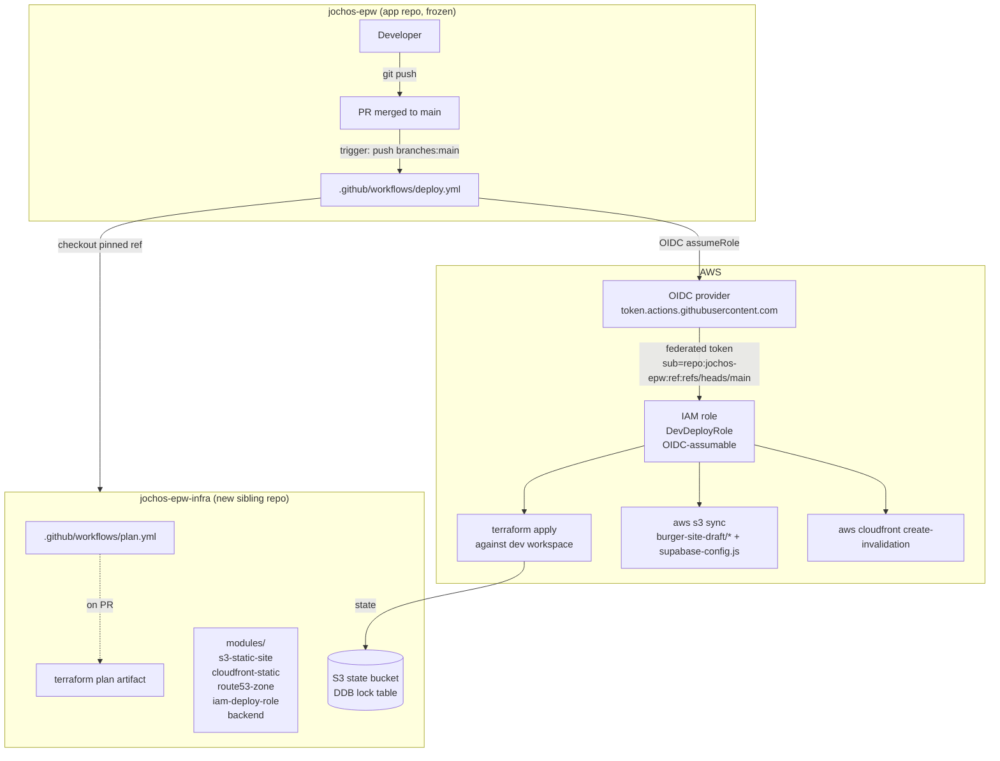

# Design: AWS Static Hosting (S3 + CloudFront + Route53, IaC in Terraform)

> **SDD phase**: design (executor)
> **Change**: `aws-static-hosting`
> **Inputs consumed**: `openspec/changes/aws-static-hosting/proposal.md`,
> `openspec/specs/static-hosting/spec.md`,
> `openspec/specs/iac-repo/spec.md`,
> `openspec/config.yaml` (`rules.design` applied below), Engram `#296`.
> **Outputs**: this document + Engram `sdd/aws-static-hosting/design`.
>
> `rules.design` applicability check:
>
> - "Document any decision that splits inline CSS into stylesheets as
>   architecture-level" — **NOT TRIGGERED**. This change adds no stylesheets;
>   it adds hosting infra only. `burger-site-draft/` is frozen
>   (spec invariant 1).
> - "Justify adding a build tool with concrete benefit before introducing
>   tooling" — **NOT TRIGGERED**. No build tool is added; deploy is
>   `aws s3 sync` of four pre-built HTML files plus `supabase-config.js`
>   (spec invariant 7). Proposal explicitly rejected the build-tool path.
>
> Both `rules.design` clauses are inert for this design — no
> architecture-level note is owed.
>
> **Round-2 rework note**: this document was re-emitted after a fresh-context
> `sdd-verify` returned FAIL (2 CRITICAL + 8 WARNING + 3 SUGGESTION). The
> fixes applied are listed in §15 "Round-2 corrections". No architectural
> choice changed; only the specifics the reviewer flagged were fixed.

## 1. Architecture overview

### 1.1 Runtime path (already covered in proposal — restated for completeness)

A user on `<dev-domain>` hits Route53 (DNSSEC-signed). Route53 returns the
CloudFront distribution's alias A/AAAA records. CloudFront terminates
TLS using the ACM cert (DNS-validated, pinned to the distribution),
applies the response-headers policy (HSTS + `X-Content-Type-Options` +
`Referrer-Policy`), serves a Brotli-compressed response when the client
advertises `br` (or `gzip` otherwise), and fetches the object from S3
with a SigV4-signed GET through the Origin Access Control (OAC).

### 1.2 Deploy path (focus of this design — diagram distinct from the proposal)



Key points the diagram encodes (the parts the proposal intentionally
left out):

- The **app-repo workflow** does the deploy, not the infra-repo one.
  The infra repo's workflow is plan-only; apply only happens from
  `jochos-epw`. This is a deliberate inversion of the usual pattern —
  the apply that mutates AWS lives in the repo whose change triggered
  it.
- OIDC trust is constrained to `repo:<app-repo-org>/jochos-epw:ref:refs/heads/main`
  (single branch, single repo). The infra repo's own CI uses
  long-lived AWS credentials for its `plan.yml` step OR a separate
  OIDC trust scoped to `repo:<infra-repo-org>/jochos-epw-infra:*` —
  see §12 for the chosen variant.
- The same OIDC role is used for both `terraform apply` and the
  post-apply `s3 sync` + CloudFront invalidation. The role's policy
  (§5) covers all three.

### 1.3 Resource ownership map

| AWS resource | Module that owns it | Environment | Slice |
|---|---|---|---|
| State bucket + DDB lock | `modules/backend` (bootstrap dir) | n/a | S1 |
| S3 static bucket | `modules/s3-static-site` | dev | S2 |
| Origin Access Control | `modules/s3-static-site` | dev | S2 |
| S3 bucket policy (OAC + distribution-ARN Condition) | `modules/cloudfront-static` | dev | S3 |
| ACM cert (DNS-validated) | `modules/cloudfront-static` | dev | S3 |
| Response headers policy | `modules/cloudfront-static` | dev | S3 |
| CloudFront distribution | `modules/cloudfront-static` | dev | S3 |
| Route53 hosted zone | `modules/route53-zone` | dev | S4 |
| Route53 alias records (A/AAAA) | `modules/route53-zone` | dev | S4 |
| DNSSEC KSK (KMS CMK + signing) | `modules/route53-zone` | dev | S4 |
| IAM deploy role + OIDC trust | `modules/iam-deploy-role` | dev | S5 |

Every resource is composed into `envs/dev/main.tf` — no resource block
duplicated across environments. Note: the S3 bucket policy moved
from `modules/s3-static-site` (proposal placement) to
`modules/cloudfront-static` in this design — see §4.2 for the rationale
and §4.3 for where the policy actually lands.

## 2. Repo layout (jochos-epw-infra)

```
jochos-epw-infra/
├── README.md                          # four required sections (§4-S1, §4-S5) — full content lands in S1
├── .github/
│   └── workflows/
│       └── plan.yml                   # plan-only CI on PR (§10) — added in S1
├── bootstrap/                         # one-shot — creates the state bucket + DDB lock table
│   ├── main.tf                        # S3 bucket (BlockPublicAccess on, versioning, lifecycle), DDB table (PK=LockID, billing-mode=PAY_PER_REQUEST)
│   ├── variables.tf                   # state_bucket_name, lock_table_name, region
│   └── outputs.tf                     # state_bucket_arn, lock_table_name
├── modules/
│   ├── backend/                       # remote-state backend composition (re-usable module invoked from envs/)
│   │   ├── main.tf                    # declares the S3 backend in a `terraform { backend "s3" {} }` block, sourced from variables
│   │   ├── variables.tf               # bucket, key, region, dynamodb_table
│   │   └── outputs.tf                 # nothing — backend block has no outputs
│   ├── s3-static-site/                # private bucket + OAC — S2
│   │   ├── main.tf                    # aws_s3_bucket (private), aws_s3_bucket_versioning, aws_s3_bucket_lifecycle_configuration, aws_s3_bucket_public_access_block, aws_cloudfront_origin_access_control (explicit HCL in §4.2)
│   │   ├── variables.tf               # bucket_name (validated: no "supabase" substring, ≤63 chars, lowercase), versioning, lifecycle_noncurrent_days, tags
│   │   └── outputs.tf                 # bucket_arn, bucket_domain_name, oac_id
│   ├── cloudfront-static/             # distribution + ACM + response-headers-policy + bucket-policy — S3
│   │   ├── main.tf                    # aws_acm_certificate (DNS validation), aws_cloudfront_response_headers_policy (with security_headers_config wrapper — §8), aws_cloudfront_distribution, aws_s3_bucket_policy (Condition on distribution ARN)
│   │   ├── variables.tf               # s3_bucket_arn, s3_bucket_domain_name, oac_id, acm_domain_name, price_class, tags, name_prefix
│   │   └── outputs.tf                 # distribution_id, distribution_domain_name, distribution_hosted_zone_id (Z2FDTNDATAQYW2), acm_certificate_arn
│   ├── route53-zone/                  # public zone + DNSSEC + alias records — S4
│   │   ├── main.tf                    # aws_route53_zone, aws_kms_key (DNSSEC KSK), aws_route53_key_signing_key, aws_route53_hosted_zone_dnssec, aws_route53_record (A + AAAA alias to CF)
│   │   ├── variables.tf               # zone_name, cloudfront_distribution_domain_name, cloudfront_hosted_zone_id (= `Z2FDTNDATAQYW2`, sourced from cloudfront-static output)
│   │   └── outputs.tf                 # zone_id, name_servers, dnssec_kms_key_arn, ds_record
│   └── iam-deploy-role/               # OIDC trust + least-privilege policy — S5
│       ├── main.tf                    # aws_iam_role (OIDC trust), aws_iam_role_policy (least-privilege inline)
│       ├── variables.tf               # app_repo_org, app_repo_name, bucket_arn, bucket_name, distribution_arn, tags
│       └── outputs.tf                 # deploy_role_arn
├── envs/
│   └── dev/
│       ├── main.tf                    # composes modules/* — no resource blocks of its own beyond `terraform { required_providers {} }`. Passes `name_prefix = "jochos-epw-dev"` to module.cloudfront_static (§4.3).
│       ├── variables.tf               # bucket_name, dev_domain, region, account_id, app_repo_org, price_class, tags, name_prefix (default "jochos-epw-dev")
│       ├── outputs.tf                 # bucket_name, distribution_id, distribution_domain_name, deploy_role_arn, hosted_zone_name_servers
│       └── remote-backend.tf          # `terraform { backend "s3" { ... } }` referencing bootstrap-created state bucket + DDB lock
└── tests/                             # lightweight — see §13 verification
    └── smoke/
        └── README.md                  # how to run the per-slice verify commands; no automated runner in S1-S5
```

**Why this shape:**

- **Modules are reusable, envs compose.** Same five modules will feed
  `envs/prod/` in S6 without modification. `envs/<env>/main.tf` is
  the only file that knows it is `dev` or `prod`.
- **`bootstrap/` is intentionally not consumed by `envs/`.** The state
  bucket and DDB lock table must exist BEFORE the first `terraform
  init` against an env — referencing them from `envs/dev/main.tf`
  would create a circular dependency (the env's state would live in
  the bucket the env itself defines). Bootstrap is a one-shot run from
  a developer laptop, then never touched again.
- **The bucket policy lives in `modules/cloudfront-static`, not in
  `modules/s3-static-site`.** The policy's `Condition` references the
  CloudFront distribution ARN, so the policy cannot be defined until
  the distribution's ARN is known — which is at S3. See §4.2 for the
  full rationale.
- **`hosted_zone_id` is NOT a variable on `modules/cloudfront-static`.**
  The CloudFront module does not consume a hosted zone — alias
  records live in `modules/route53-zone`, which receives the
  CloudFront `distribution_hosted_zone_id` (the static
  `Z2FDTNDATAQYW2`) via the env's `main.tf`. Removing the dead
  variable keeps the module's contract honest. See §4.3.
- **No `prod/` in this change.** Per the proposal and the `iac-repo`
  spec (carry-over open question 2), `prod/` is a follow-up slice
  (S6).
- **`burger-site-draft/` MUST NOT exist** in the infra repo —
  `iac-repo` spec requirement "app repo does not contain Terraform
  resource definitions" is mirrored as "infra repo does not contain
  application code."

## 3. App-repo workflow additions

`.github/workflows/deploy.yml` lives at `jochos-epw/.github/workflows/deploy.yml`
— the **app repo** consumes infra, per `iac-repo` spec requirement
"App-repo deploy workflow consumes infra via OIDC". The infra repo
already owns its own `plan.yml` (§10); this one is the deploy trigger.

```yaml
name: deploy-dev
on:
  push:
    branches: [main]
    paths:
      - 'burger-site-draft/**'
      - '.github/workflows/deploy.yml'
  workflow_dispatch:
    inputs:
      disable_invalidation:
        description: 'Suppress CloudFront invalidation (HTML TTL 300s will catch up)'
        type: boolean
        required: false
        default: false

# Restrict default token; grant only the OIDC write permission.
permissions:
  id-token: write   # required for aws-actions/configure-aws-credentials
  contents: read

concurrency:
  group: deploy-dev
  cancel-in-progress: false   # never cancel a deploy mid-flight

jobs:
  deploy:
    runs-on: ubuntu-latest
    timeout-minutes: 15
    env:
      AWS_REGION: ${{ vars.AWS_REGION }}
      TERRAFORM_VERSION: ${{ vars.TERRAFORM_VERSION }}
      INFRA_REPO: ${{ vars.INFRA_REPO }}                       # "<infra-repo-org>/jochos-epw-infra"
      INFRA_REF: ${{ vars.INFRA_REF }}                         # pinned tag or SHA (e.g., "v0.3.0" or commit SHA)
      DEV_DEPLOY_ROLE_ARN: ${{ vars.DEV_DEPLOY_ROLE_ARN }}     # output from envs/dev
      DEV_BUCKET: ${{ vars.DEV_BUCKET }}                       # output from envs/dev
      DEV_DISTRIBUTION_ID: ${{ vars.DEV_DISTRIBUTION_ID }}     # output from envs/dev
      SUPABASE_CONFIG_SRC: ${{ vars.SUPABASE_CONFIG_SRC }}     # "burger-site-draft/supabase-config.js" — gitignored
      # DISABLE_INVALIDATION is normalized in a dedicated step (see below).
      # The env var holds the repo variable's string value ("true"/"false"/"").
      DISABLE_INVALIDATION_RAW: ${{ vars.DISABLE_INVALIDATION || '' }}

    steps:
      - name: Checkout app repo
        uses: actions/checkout@v4

      # Unghoke the gitignored supabase-config.js from a trusted source.
      # Production-grade: read from GitHub Actions secret store or an
      # S3-backed secret. For the MVP: restore from the developer's
      # last-good artifact or the most recent successful workflow's
      # uploaded artifact. (Decision recorded in §12.)
      - name: Restore supabase-config.js
        run: |
          if [ ! -f "$SUPABASE_CONFIG_SRC" ]; then
            echo "::error::supabase-config.js is missing. It is gitignored — restore from the team's secure store before deploying."
            exit 1
          fi

      # Normalize the DISABLE_INVALIDATION flag. Truthiness is explicit:
      #   - The repo variable wins.
      #   - workflow_dispatch input ORed in (only when set).
      #   - Anything other than the literal "true" is treated as false.
      # The normalized value is exported via $GITHUB_ENV for the steps
      # that branch on it (CloudFront invalidation block below).
      - name: Normalize DISABLE_INVALIDATION
        env:
          DISABLE_INVALIDATION_RAW: ${{ env.DISABLE_INVALIDATION_RAW }}
          INPUT_DISABLE_INVALIDATION: ${{ inputs.disable_invalidation }}
        run: |
          raw="$DISABLE_INVALIDATION_RAW"
          input="$INPUT_DISABLE_INVALIDATION"
          normalized="false"
          if [ "$raw" = "true" ] || [ "$input" = "true" ]; then
            normalized="true"
          fi
          echo "DISABLE_INVALIDATION=$normalized" >> "$GITHUB_ENV"
          echo "DISABLE_INVALIDATION resolved to: $normalized"

      - name: Configure AWS credentials (OIDC)
        uses: aws-actions/configure-aws-credentials@v4
        with:
          role-to-assume: ${{ env.DEV_DEPLOY_ROLE_ARN }}
          aws-region: ${{ env.AWS_REGION }}

      - name: Setup Terraform
        uses: hashicorp/setup-terraform@v3
        with:
          terraform_version: ${{ env.TERRAFORM_VERSION }}

      - name: Checkout infra repo at pinned ref
        working-directory: infra
        run: |
          git init -q
          git remote add origin "https://github.com/${INFRA_REPO}.git"
          git fetch --depth 1 origin "$INFRA_REF"
          git checkout FETCH_HEAD

      - name: terraform init
        working-directory: infra/envs/dev
        run: terraform init -input=false

      - name: terraform apply (auto-approve gated by main + paths filter)
        working-directory: infra/envs/dev
        run: terraform apply -auto-approve -input=false

      - name: aws s3 sync (four HTML files + supabase-config.js)
        run: |
          aws s3 sync ./burger-site-draft/ "s3://${DEV_BUCKET}/" \
            --exclude "*" \
            --include "index.html" \
            --include "menu.html" \
            --include "checkout.html" \
            --include "admin.html" \
            --include "supabase-config.js" \
            --delete \
            --cache-control "public, max-age=300" \
            --content-type-from-filename

      # Truthiness is normalized to the literal string "true" or "false"
      # in the "Normalize DISABLE_INVALIDATION" step above. The branch is
      # therefore a strict string equality, not a JS-truthy expression.
      - name: CloudFront invalidation (suppressed by DISABLE_INVALIDATION)
        if: env.DISABLE_INVALIDATION != 'true'
        run: |
          aws cloudfront create-invalidation \
            --distribution-id "$DEV_DISTRIBUTION_ID" \
            --paths "/index.html" "/menu.html" "/checkout.html" "/admin.html" "/supabase-config.js"

      - name: CloudFront invalidation suppressed
        if: env.DISABLE_INVALIDATION == 'true'
        run: echo "invalidation suppressed via DISABLE_INVALIDATION — HTML TTL 300s will catch up within 5 min"
```

**Trigger, permissions, and env var contract — matching the spec:**

| Step | Required secret / env | Source |
|---|---|---|
| Configure AWS credentials (OIDC) | `DEV_DEPLOY_ROLE_ARN` | `vars.DEV_DEPLOY_ROLE_ARN` (Terraform output) |
| Configure AWS credentials (OIDC) | `AWS_REGION` | `vars.AWS_REGION` |
| Setup Terraform | `TERRAFORM_VERSION` | `vars.TERRAFORM_VERSION` (e.g., `1.9.8`) |
| Checkout infra repo at pinned ref | `INFRA_REPO`, `INFRA_REF` | `vars.INFRA_REPO` (`<infra-repo-org>/jochos-epw-infra`), `vars.INFRA_REF` (tag or SHA) |
| `aws s3 sync` | `DEV_BUCKET` | `vars.DEV_BUCKET` |
| CloudFront invalidation | `DEV_DISTRIBUTION_ID` | `vars.DEV_DISTRIBUTION_ID` |
| CloudFront invalidation opt-out | `DISABLE_INVALIDATION` (normalized) | `vars.DISABLE_INVALIDATION` OR `workflow_dispatch` input `disable_invalidation` |

**No long-lived AWS keys** appear in any secret or env. The
OIDC token exchange is the only credential.

## 4. Per-slice design

Each slice is ≤ ~400 lines of diff and ends with a green deploy (or,
for S1, a green plan-only CI run with zero resource changes). The
400-line cap is binding — see §11 risk #6.

### 4.0 Slice plan deviations from the proposal

Two deviations from `proposal.md` "Slice plan / PR boundaries" table
are required by the 400-line review budget. Both are documented here
so the apply phase does not need to re-litigate them.

| # | Deviation | Proposal said | This design does | Justification |
|---|---|---|---|---|
| 1 | **Route53 zone creation moves from S3 to S4** | S3 includes "Route53 zone also created here if not at registrar" | Route53 + DNSSEC is its own slice (S4) | The 400-line cap cannot absorb both the CloudFront distribution (with full HCL, response headers, OAC reference, ACM) AND the Route53 zone + KMS-backed KSK + DNSSEC signing + alias records. Splitting Route53 into S4 keeps both slices reviewable. Trade-off: between S3-end and S4-end, the distribution is reachable only via the native CloudFront domain (`<dist>.cloudfront.net`) — see §4.3 for the smoke-test adjustments. |
| 2 | **Success criterion "within 60s" → "within 5 min"** | S5 success criterion: "CloudFront serves the new bytes within 60s" | S5 success criterion: "CloudFront serves the new bytes within 5 min (HTML TTL 300s + invalidation propagation)" | The 60s target in `proposal.md` line 103 was optimistic for non-cached files. The HTML TTL is 300s (`§9.1`), so a deploy without an invalidation call takes up to 5 min to surface; with an invalidation call, propagation adds another 30–60s on top. 5 min is the canonical target. |

These deviations are scoped to this design; the proposal is unchanged.
See §11 (Open questions) and §14 (Risks) for downstream impact.

### 4.1 Slice S1 — Repo bootstrap

**Goal**: stand up `jochos-epw-infra` with a Terraform skeleton, dev
env directory, remote-state reference, README, and a plan-only CI
workflow. No AWS resources touched by apply.

| Aspect | Detail |
|---|---|
| Terraform files added | `bootstrap/main.tf`, `bootstrap/variables.tf`, `bootstrap/outputs.tf`, `modules/backend/{main,variables,outputs}.tf`, `envs/dev/{main,variables,outputs,remote-backend}.tf`, top-level `.gitignore` |
| Workflow files added | `.github/workflows/plan.yml` (§10) |
| Variables added | (bootstrap) `state_bucket_name`, `lock_table_name`, `region`; (envs/dev) `region`, `account_id`, `tags`, `name_prefix` (default `"jochos-epw-dev"`) |
| Outputs added | (bootstrap) `state_bucket_arn`, `lock_table_name`; (envs/dev) none yet (resources defined later) |
| Verify command | `terraform plan -detailed-exitcode` → returns 0 (no diff) |
| Rollback | `rm -rf jochos-epw-infra` (nothing in AWS yet) |
| Line budget | ~250 lines |

**S1 also writes the README skeleton** — all four required sections
(`Prerequisites`, `Bootstrap a new environment`, `Rotate state`, `Roll
back a deploy`) — even though some procedures reference slices that
have not landed yet. Each section gets a one-line "(filled in by slice
Sx)" callout where it references as-yet-undefined resources.

### 4.2 Slice S2 — S3 bucket + OAC

**Goal**: create the private S3 bucket, the OAC, and the
`BlockPublicAccess` lock-down. **No bucket policy is created in this
slice** — the policy lands in S3 alongside the CloudFront distribution
because its `Condition` references the distribution ARN (see "Bucket
policy placement" below).

| Aspect | Detail |
|---|---|
| Terraform files added | `modules/s3-static-site/{main,variables,outputs}.tf` |
| Terraform files modified | `envs/dev/main.tf` (composes `module "s3_static_site"`), `envs/dev/variables.tf` (`bucket_name`) |
| Variables added | `bucket_name` (validated: ≤63 chars, lowercase, no underscores, no "supabase" substring) |
| Outputs added | `bucket_name`, `bucket_arn`, `bucket_domain_name`, `oac_id` |
| Workflow files | none (apply is gated by S5) |
| Verify commands | `aws s3api get-public-access-block --bucket <bucket>` → all four flags `true`; `aws s3api get-bucket-policy-status --bucket <bucket>` → `IsPublic: false` (no policy yet — `IsPublic: false` holds because `BlockPublicAccess` is on, NOT because a non-public policy is attached); `curl https://<bucket>.s3.amazonaws.com/index.html` → `403 AccessDenied` |
| Rollback | `terraform destroy -target=module.s3_static_site` (no traffic served yet) |
| Line budget | ~150 lines |

**Bucket name validation in `variables.tf`** uses Terraform's
`validation` block — fails `terraform plan` if the name contains
"supabase" or exceeds S3 limits.

**Explicit OAC HCL (lives in `modules/s3-static-site/main.tf`)** —
added so the spec-required `signing_behavior = "always"` and
`signing_protocol = "sigv4"` are visible in the design (spec
requirement "OAC signing behaviour is always + SigV4"):

```hcl
resource "aws_cloudfront_origin_access_control" "s3" {
  name                              = "${var.bucket_name}-oac"
  description                       = "OAC for ${var.bucket_name} S3 origin"
  origin_access_control_origin_type = "s3"
  signing_behavior                  = "always"
  signing_protocol                  = "sigv4"
}
```

**Bucket policy placement — why the policy is NOT in this slice.**

The bucket policy that admits the CloudFront OAC principal carries a
`Condition` on the CloudFront distribution ARN (spec scenario "OAC
service principal is the only allowed bucket ingress"). The distribution
ARN does not exist until S3 creates the distribution. There are two
options:

- **Option A (chosen)** — define `aws_s3_bucket_policy` in
  `modules/cloudfront-static`. In S2, the bucket exists, there is no
  policy, and `get-bucket-policy-status` returns `IsPublic: false`
  because `BlockPublicAccess` is on (policy absence + BPA = no public
  ingress). In S3, the policy is created alongside the distribution
  with the `Condition { StringEquals { "AWS:SourceArn" = distribution.arn } }`
  bound to the distribution just created.
- **Option B** — define the policy in `modules/s3-static-site` without
  the distribution ARN Condition (just allow the OAC service
  principal), then add the `Condition` in S3. This is rejected because
  it leaves the bucket with a less-restrictive policy between S2-end
  and S3-end than the spec requires. `BlockPublicAccess` would still
  prevent a public read, but the principle of least surprise demands
  the most restrictive policy from the first moment the resource
  exists.

Option A keeps the bucket policy version-controlled together with the
distribution it constrains, and avoids a "less restrictive than final"
intermediate state.

### 4.3 Slice S3 — CloudFront + ACM + bucket policy

**Goal**: create the ACM cert (DNS-validated), the response-headers
policy, the CloudFront distribution that fronts the S3 bucket via OAC,
and the OAC-restricting bucket policy (Option A in §4.2). DNS-validated
cert records created here are placeholders; Route53 records that
satisfy validation land in S4 (this is the slice plan deviation #1
documented in §4.0).

| Aspect | Detail |
|---|---|
| Terraform files added | `modules/cloudfront-static/{main,variables,outputs}.tf` |
| Terraform files modified | `envs/dev/main.tf` (composes `module "cloudfront_static"` and passes `name_prefix = var.name_prefix`), `envs/dev/variables.tf` (`acm_domain_name` — value is `<dev-domain>`) |
| Variables added | `s3_bucket_arn`, `s3_bucket_domain_name`, `oac_id` (from S2), `acm_domain_name`, `price_class` (default `PriceClass_100`), `name_prefix` (from `envs/dev/variables.tf`) |
| Outputs added | `distribution_id`, `distribution_domain_name`, `distribution_hosted_zone_id` (always `Z2FDTNDATAQYW2` for CloudFront — consumed by S4), `acm_certificate_arn` |
| Workflow files | none |
| Verify commands | `terraform plan` (clean); `aws cloudfront get-distribution-config --id <id>` → `HttpVersion=http2and3`, `ViewerCertificate.ACMCertificateArn` set, origin has `OriginAccessControlId` not `OriginAccessIdentity`; `aws s3api get-bucket-policy --bucket <bucket>` → JSON contains `"AWS:SourceArn": "arn:aws:cloudfront::<account>:distribution/<id>"`; `curl -I https://<native-cloudfront-domain>` → 200/403 + `Strict-Transport-Security` header present |
| Rollback | `terraform destroy -target=module.cloudfront_static` (no DNS yet, so no traffic — reachable only via the native `<dist>.cloudfront.net` URL during S3's smoke test) |
| Line budget | ~250 lines |

**Native CloudFront domain used for S3 smoke test.** Because the
custom `<dev-domain>` does not resolve to the distribution until S4
publishes the Route53 alias record, the S3 verify row uses the native
CloudFront domain (`<distribution-id>.cloudfront.net`) returned by
`distribution_domain_name`. The ACM cert is DNS-validated but
cert-validation records are placeholders in S3 (validation completes
once S4 publishes the Route53 records); the distribution is still
created with `viewer_certificate.acm_certificate_arn` set, and
CloudFront waits for validation before serving HTTPS at the custom
domain — the native domain is reachable once validation succeeds.

**`name_prefix` variable on `modules/cloudfront-static/variables.tf`:**

```hcl
variable "name_prefix" {
  type        = string
  description = "Prefix applied to all CloudFront-managed resource names (e.g., 'jochos-epw-dev')."
}
```

`envs/dev/main.tf` passes it through:

```hcl
module "cloudfront_static" {
  source      = "../../modules/cloudfront-static"
  name_prefix = var.name_prefix   # "jochos-epw-dev"
  # ... other vars from §4.3 ...
}
```

**`hosted_zone_id` is intentionally NOT a variable on this module.**
The CloudFront distribution itself does not consume a hosted zone —
alias records live in `modules/route53-zone`. `hosted_zone_id` as a
module input was dead code in the round-1 design; it is removed.
CloudFront's static `Z2FDTNDATAQYW2` is exposed as an output and
consumed by `modules/route53-zone` via the env's `main.tf`.

**ACM cert in `us-east-1`**: CloudFront is a global service that
requires ACM certs in `us-east-1` regardless of the stack's working
region. The `aws_acm_certificate` resource declares
`provider = aws.us_east_1`, requiring an aliased provider in
`modules/cloudfront-static/main.tf`. This is a concrete design choice
documented in §12.

### 4.4 Slice S4 — Route53 + DNSSEC

**Goal**: create the hosted zone, the DNSSEC KSK (KMS-backed),
DNSSEC signing, the alias A/AAAA records pointing at the CloudFront
distribution, and the Route53 records that satisfy ACM DNS validation
for S3's cert. **This is the slice that flips DNS to the custom
domain** — until S4 lands, the dev site is reachable only via the
native CloudFront URL (`§4.3`).

| Aspect | Detail |
|---|---|
| Terraform files added | `modules/route53-zone/{main,variables,outputs}.tf` |
| Terraform files modified | `envs/dev/main.tf` (composes `module "route53_zone"`), `envs/dev/variables.tf` (`zone_name`), `envs/dev/outputs.tf` (`hosted_zone_name_servers`, `dnssec_ds_record`) |
| Variables added | `zone_name` (= `<dev-domain>`), `cloudfront_distribution_domain_name` (= `module.cloudfront_static.distribution_domain_name`), `cloudfront_hosted_zone_id` (= `module.cloudfront_static.distribution_hosted_zone_id`, the static `Z2FDTNDATAQYW2`) |
| Outputs added | `hosted_zone_id`, `name_servers`, `dnssec_kms_key_arn`, `dnssec_ds_record` |
| Workflow files | none |
| Verify commands | `aws route53 get-hosted-zone --id <zone-id>` → `DNSSEC.Status=SIGNING`, non-empty `KeySigningKey`; `dig +dnssec <dev-domain>` → `ad` flag (after DS record is published at the registrar); `dig <dev-domain>` → returns the CloudFront alias target; `curl -I https://<dev-domain>` → `Strict-Transport-Security` header present (proves DNS now routes to the distribution) |
| Rollback | `terraform destroy -target=module.route53_zone`; manually remove the DS record at the registrar |
| Line budget | ~200 lines |

**DS-record handoff is a manual step** documented in the README:
Terraform prints the DS record as an output, but the parent zone
(`com`, `net`, etc.) lives at the registrar — Terraform cannot
publish it. The README's "Bootstrap a new environment" section
documents the registrar-side step.

**ACM DNS validation records land here, not in S3.** This is a
consequence of the slice plan deviation #1 (`§4.0`). The cert
resource is created in S3, but the Route53 records that prove
ownership can only exist once the hosted zone exists. S3 declares the
`aws_route53_record` resources via `for_each = { for o in aws_acm_certificate.main.domain_validation_options : o.domain_name => o }`,
guarded by `count = var.create_route53_records ? 1 : 0` with
`create_route53_records = false` in S3 and flipped to `true` once S4
adds the `aws_route53_zone` reference.

### 4.5 Slice S5 — Deploy automation

**Goal**: stand up the OIDC trust + deploy role in `iac-repo`, the
app-repo deploy workflow that consumes infra, and the team conventions
for syncing the four HTML files + `supabase-config.js`.

| Aspect | Detail |
|---|---|
| Terraform files added | `modules/iam-deploy-role/{main,variables,outputs}.tf` |
| Terraform files modified | `envs/dev/main.tf` (composes `module "iam_deploy_role"`), `envs/dev/variables.tf` (`app_repo_org`, `app_repo_name` — both placeholders), `envs/dev/outputs.tf` (`deploy_role_arn`) |
| Workflow files added | `jochos-epw/.github/workflows/deploy.yml` (§3) |
| Workflow files modified | none (this slice is the FIRST workflow in the app repo) |
| Variables added | `app_repo_org` (= `<app-repo-org>`), `app_repo_name` (= `jochos-epw`), `bucket_arn`, `bucket_name`, `distribution_arn` |
| Outputs added | `deploy_role_arn` |
| Verify commands | One-character edit to `burger-site-draft/index.html` → merge to `main` → bytes at `https://<dev-domain>/index.html` **within 5 minutes** (HTML TTL 300s + invalidation propagation — see §4.0 deviation #2); `aws iam simulate-principal-policy --policy-source-arn <role> --action-names s3:DeleteBucket --action-names s3:PutBucketPolicy --action-names cloudfront:CreateDistribution --action-names iam:PassRole` → all `implicitDeny` or `explicitDeny`; `gh secret list` (in both repos) → no `AWS_ACCESS_KEY*`, `AWS_SECRET_*`, `AWS_SESSION_TOKEN`, or `AKIA*` secret |
| Rollback | Revert the workflow file in the app repo; `terraform destroy -target=module.iam_deploy_role` (deploy role is unused once workflow is gone) |
| Line budget | ~150 lines |

**Slice plan note — 5-minute target is canonical.** The 5-minute window
covers both propagation modes:

1. **With `DISABLE_INVALIDATION=false`** (default) — invalidation
   completes within 30–60s, then HTML TTL 300s covers any object not in
   the invalidation path.
2. **With `DISABLE_INVALIDATION=true`** — HTML TTL 300s catches up the
   changed files on its own; the 5-minute window covers the worst-case
   HTML TTL.

`proposal.md` line 103 said "within 60s", which only holds if every
changed file is in the invalidation path AND CloudFront propagation
is faster than 60s in this region. The 5-minute window is the
robust-to-both-modes target. See §4.0 deviation #2.

**S5 also fills in the last two README sections**: "Bootstrap a new
environment" grows the step "register the OIDC provider in IAM and
paste the deploy role ARN into `vars.DEV_DEPLOY_ROLE_ARN` in the app
repo," and "Roll back a deploy" gains the `aws s3 cp` + `versionId`
recipe for bad HTML deploys.

### 4.6 Slice S6 (optional, follow-up) — Prod env

**Goal**: stand up `envs/prod/`, a new S3 bucket, a new CloudFront
distribution, a new ACM cert, a new Route53 zone (or use the existing
apex), and a new deploy role — all by composing the same `modules/*`
tree.

| Aspect | Detail |
|---|---|
| Terraform files added | `envs/prod/{main,variables,outputs,remote-backend}.tf` (state key `jochos-epw/prod/terraform.tfstate`) |
| Terraform files modified | none (envs compose modules — adding an env never edits a module) |
| Workflow files added | `jochos-epw/.github/workflows/deploy-prod.yml` (clone of `deploy.yml` with `DEV_*` vars renamed `PROD_*` and `paths` filter; manual `workflow_dispatch` only — no `push` to `main` auto-deploy to prod) |
| Variables added | (envs/prod) full duplicate of dev's variable set, namespaced `prod_*` |
| Outputs added | `prod_bucket_name`, `prod_distribution_id`, `prod_distribution_domain_name`, `prod_deploy_role_arn` |
| Verify commands | Same as S5 against the prod domain |
| Rollback | `terraform destroy -target=module.s3_static_site -target=module.cloudfront_static -target=module.route53_zone -target=module.iam_deploy_role` in `envs/prod/` |
| Line budget | ~250 lines |

S6 is **NOT in scope** for this change. It is documented here so the
modules are designed with multi-env composition in mind (no hard-coded
`dev` strings inside modules — verified by `grep -r "dev" modules/`).

## 5. IAM deploy role policy

The deploy role is defined in `modules/iam-deploy-role/main.tf` and
attached as an inline policy (small enough; no managed policy
needed). The policy is **least-privilege on a single bucket and a
single distribution** — verified by `aws iam simulate-principal-policy`
in §13.

```json
{
  "Version": "2012-10-17",
  "Statement": [
    {
      "Sid": "BucketListForSync",
      "Effect": "Allow",
      "Action": "s3:ListBucket",
      "Resource": "arn:aws:s3:::<dev-bucket>"
    },
    {
      "Sid": "BucketObjectReadWrite",
      "Effect": "Allow",
      "Action": [
        "s3:GetObject",
        "s3:PutObject",
        "s3:DeleteObject"
      ],
      "Resource": "arn:aws:s3:::<dev-bucket>/*"
    },
    {
      "Sid": "CloudFrontInvalidateOnly",
      "Effect": "Allow",
      "Action": "cloudfront:CreateInvalidation",
      "Resource": "arn:aws:cloudfront::<account>:distribution/<dev-distribution-id>"
    }
  ]
}
```

**Note on the `cloudfront:CreateInvalidation` statement.** An earlier
draft of this design included a `"Condition": { "StringEquals":
{ "aws:RequestedRegion": "*" } }` block on this statement. That
condition is a **no-op** — CloudFront is a global service, and
`aws:RequestedRegion` is meaningful only for regional services where
AWS routes the request. The condition was carried forward from a
copy-paste of an S3-region-scoped policy; it has been removed. The
statement's resource-level restriction (`distribution/<dev-distribution-id>`)
is what enforces the "single distribution" invariant — a `Condition`
would only have added noise.

**Forbidden actions (verified absent by `simulate-principal-policy`):**

- `s3:DeleteBucket` — bucket deletion is a manual out-of-band action.
- `s3:PutBucketPolicy` / `s3:PutBucketPublicAccessBlock` — bucket
  policy is the `iac-repo`'s job; the deploy role never edits it.
- `cloudfront:CreateDistribution` / `UpdateDistribution` /
  `DeleteDistribution` — distribution mutation is the `iac-repo`'s
  job.
- `iam:PassRole`, `iam:CreateRole`, `iam:*` — role mutation is
  out-of-band.
- Any `*` action.

The role's `AssumeRolePolicyDocument` is in §6. The role's
`PermissionsBoundary` is `null` (intentional — the inline policy
above is already tight enough; a boundary would be belt-and-suspenders
at MVP scale).

## 6. OIDC trust policy

Defined on the deploy role in `modules/iam-deploy-role/main.tf`. Only
the **main branch** of the **app repo** can assume the role. The
infra repo's own CI uses a separate OIDC trust (see §12 cross-cutting
choice "infra-repo OIDC").

```json
{
  "Version": "2012-10-17",
  "Statement": [
    {
      "Sid": "GitHubOIDC",
      "Effect": "Allow",
      "Principal": {
        "Federated": "arn:aws:iam::<account>:oidc-provider/token.actions.githubusercontent.com"
      },
      "Action": "sts:AssumeRoleWithWebIdentity",
      "Condition": {
        "StringEquals": {
          "token.actions.githubusercontent.com:aud": "sts.amazonaws.com"
        },
        "StringLike": {
          "token.actions.githubusercontent.com:sub": "repo:<app-repo-org>/jochos-epw:ref:refs/heads/main"
        }
      }
    }
  ]
}
```

**Why `StringLike` on `sub`**: the format
`repo:<org>/<repo>:ref:refs/heads/<branch>` is GitHub's documented
shape; `StringLike` is required because of the wildcard semantics
(if we ever broaden to `:*`, that change is one diff line). For
single-branch, single-repo, `StringEquals` would also work — but the
spec carries `StringLike` for forward-compatibility.

**Why `aud: sts.amazonaws.com`**: GitHub's OIDC tokens carry this
audience by default; rejecting any other audience is a cheap defence
against token replay against other AWS services.

## 7. State backend topology

### 7.1 State bucket

| Attribute | Value | Rationale |
|---|---|---|
| Name (suggested) | `jochos-epw-tfstate-<account-id>-<region>` | Globally unique; embeds account id to avoid collisions across accounts in the same org |
| `BlockPublicAccess` | `on` for all four flags | `iac-repo` spec scenario "state bucket has BlockPublicAccess and lifecycle" |
| Versioning | enabled | `iac-repo` spec requirement; required for the rotate-state procedure |
| Lifecycle rule | `NoncurrentVersionExpiration { noncurrent_days = 30 }` | Prune stale state versions so the bucket doesn't grow unbounded |
| Default encryption | `SSE-S3` (AES256) | §12 cross-cutting choice — free, no KMS overhead for MVP |
| `mfa_delete` | disabled | §12 cross-cutting choice — versioning alone is enough; `mfa_delete` adds ops burden (lost device = unrecoverable state) |
| Object ownership | `BucketOwnerEnforced` (ACLs disabled) | Modern best practice; ACLs cannot leak around the bucket policy |
| Lifecycle rule on the dev-state key | none (versioning handles it) | n/a |

### 7.2 Lock table

| Attribute | Value |
|---|---|
| Name | `jochos-epw-tflock` |
| Partition key | `LockID` (string) |
| Billing mode | `PAY_PER_REQUEST` (no provisioned capacity) |
| `BlockPublicAccess` | not applicable (DynamoDB has no public surface) |
| Point-in-time recovery | enabled (free under 25 GB) — defence in depth against a torn write |

### 7.3 Bootstrap sequence (one-shot)

1. Engineer runs `terraform init && terraform apply` from
   `bootstrap/` (with credentials that can create S3 + DDB — typically
   the engineer's AWS SSO role).
2. Bootstrap output: state bucket ARN, lock table name.
3. Engineer updates `envs/dev/remote-backend.tf` with those values.
4. Engineer commits `envs/dev/remote-backend.tf` and runs `terraform
   init` from `envs/dev/` — now backend-backed.
5. `bootstrap/` is never touched again.

**Why bootstrap is not in `modules/`**: the state bucket cannot be
defined by the same code that uses it as a backend — circular
dependency. The cleanest solution is a separate `bootstrap/` directory
with its own state (local, ephemeral, throwaway).

## 8. CloudFront response headers

`modules/cloudfront-static/main.tf` declares an
`aws_cloudfront_response_headers_policy` resource and attaches it to
the distribution's `default_cache_behavior.response_headers_policy_id`.
**This is the response-headers-policy resource, NOT a CloudFront
Function** — Lambda-at-edge is deferred per the proposal (vanilla
HTML needs no URL rewriting today).

```hcl
resource "aws_cloudfront_response_headers_policy" "security" {
  name    = "${var.name_prefix}-security-headers"
  comment = "HSTS + nosniff + Referrer-Policy for jochos-epw"

  security_headers_config {
    strict_transport_security {
      override                   = true
      include_subdomains         = true
      preload                    = true
      access_control_max_age_sec = 31536000
    }
    content_type_options {
      override = true
    }
    referrer_policy {
      override        = true
      referrer_policy = "strict-origin-when-cross-origin"
    }
  }

  # Additional security headers considered and deferred (see §12):
  # - xss_protection: legacy; modern browsers ignore it (CSP replaces it).
  # - content_security_policy: would require knowing every origin the
  #   site talks to (Supabase URL, fonts, images); deferred to a
  #   follow-up change.
  # - frame_options: not added because CSP frame-ancestors supersedes it.
}
```

The three nested security-header blocks (`strict_transport_security`,
`content_type_options`, `referrer_policy`) MUST live inside a single
`security_headers_config { ... }` wrapper per the AWS provider schema
— placing them at the top level of the resource is a Terraform plan
error (`An argument named ... is not expected here`). The round-1
design had them at the top level and would have failed `terraform
plan`; this is fixed here.

**Why response-headers-policy over a CloudFront Function**: declarative
configuration is auditable in Terraform (a reviewer reads the HCL and
sees the exact headers), free at the CloudFront edge (no per-invocation
cost), and applies to BOTH successful responses and redirects — which
the spec requires for HSTS (`static-hosting` requirement "TLS-only
viewer policy and HSTS on every response").

## 9. Cache TTLs and behaviors

The distribution has **two cache behaviors**:

### 9.1 Path-pattern behavior: `*.html` (HTML TTL 300s)

```hcl
ordered_cache_behavior {
  path_pattern     = "*.html"
  target_origin_id = "s3-static-site"

  viewer_protocol_policy = "redirect-to-https"
  allowed_methods        = ["GET", "HEAD"]
  cached_methods         = ["GET", "HEAD"]
  compress               = true

  # Legacy cache settings (no managed cache policy) — gives the
  # spec-required 300s TTL on HTML.
  default_ttl = 300
  min_ttl     = 0
  max_ttl     = 300

  response_headers_policy_id = aws_cloudfront_response_headers_policy.security.id
}
```

### 9.2 Default behavior: everything else (TTL 31536000 = 1 year)

```hcl
default_cache_behavior {
  target_origin_id = "s3-static-site"

  viewer_protocol_policy = "redirect-to-https"
  allowed_methods        = ["GET", "HEAD", "OPTIONS"]
  cached_methods         = ["GET", "HEAD"]
  compress               = true

  # AWS managed CachingOptimized policy: TTL 31536000, varies by
  # Content-Type, honors Cache-Control where the origin sets it.
  cache_policy_id          = "658327ea-f89d-4fab-a63d-7e88639e58f6"
  response_headers_policy_id = aws_cloudfront_response_headers_policy.security.id
}
```

**Why managed `CachingOptimized` for the default behavior**: it is
AWS-maintained, free, and embeds the same TTL semantics the spec
requires for static assets (1 year). Building a custom
`aws_cloudfront_cache_policy` for static assets would duplicate AWS's
own work and require keeping the policy in sync with AWS's tuning.

**Content-hashed filenames are NOT in this change.** The 1-year TTL
on the default behavior is correct for the future case where filenames
contain hashes (`main.<hash>.css`); today's filenames are NOT hashed,
so the deploy step MUST issue a CloudFront invalidation for any
changed non-HTML path. This is documented in the README's "Roll back a
deploy" section AND in `static-hosting` spec scenario "content-
hashed filenames are a follow-up, not a requirement."

`supabase-config.js` is sync'd with `--cache-control "public,
max-age=300"` by the deploy workflow (§3), so even if it lands in the
default cache behavior, CloudFront will honor the origin's 300s TTL.
This is a deliberate belt-and-suspenders: if the cache-behavior
priority ever changes, the JS still won't be cached for a year.

## 10. CI workflow (infra repo)

`.github/workflows/plan.yml` lives at
`jochos-epw-infra/.github/workflows/plan.yml`. Plan-only on every PR.
Apply requires an explicit `workflow_dispatch` AND the `tools/apply`
repo variable — see `iac-repo` spec requirement "Plan-only CI on PR,
manual approval to apply."

```yaml
name: terraform-plan
on:
  pull_request:
    branches: [main]
    paths:
      - '**/*.tf'
      - '**/*.tfvars'
      - '.github/workflows/plan.yml'
  workflow_dispatch:
    inputs:
      apply:
        description: 'Set to "true" to actually apply (requires tools/apply repo variable)'
        type: boolean
        required: false
        default: false

permissions:
  contents: read
  pull-requests: write   # for posting plan output as a PR comment
  id-token: write        # required for OIDC (infra-repo CI uses a separate OIDC trust — see §12)

jobs:
  plan:
    runs-on: ubuntu-latest
    timeout-minutes: 10
    env:
      AWS_REGION: ${{ vars.AWS_REGION }}
      TERRAFORM_VERSION: ${{ vars.TERRAFORM_VERSION }}
      TF_INPUT: '0'            # never prompt for vars

    steps:
      - uses: actions/checkout@v4

      # OAI invariant guard — catches the spec FORBIDDEN resource before
      # any AWS call is made. The grep is cheap (runs against the
      # checked-out source, not against AWS) and the message names OAC
      # as the required control so the next reviewer knows what to do.
      - name: OAI invariant guard (OAC only)
        run: |
          if grep -rE 'aws_cloudfront_origin_access_identity' modules/; then
            echo "::error::OAI is FORBIDDEN by static-hosting spec. Use aws_cloudfront_origin_access_control instead."
            exit 1
          fi

      - name: Setup Terraform
        uses: hashicorp/setup-terraform@v3
        with:
          terraform_version: ${{ env.TERRAFORM_VERSION }}

      # PR path: plan only, no AWS auth needed for the format/validate
      # steps. For the plan step we still init -backend=false so
      # there's no accidental read of the state bucket.
      - name: terraform fmt -check
        working-directory: envs/dev
        run: terraform fmt -check -recursive ../..

      - name: terraform init (no backend)
        working-directory: envs/dev
        run: terraform init -backend=false -input=false

      - name: terraform validate
        working-directory: envs/dev
        run: terraform validate

      - name: Configure AWS credentials (OIDC, infra-repo trust)
        if: github.event_name == 'workflow_dispatch' || github.event_name == 'pull_request'
        uses: aws-actions/configure-aws-credentials@v4
        with:
          role-to-assume: ${{ vars.INFRA_PLAN_ROLE_ARN }}
          aws-region: ${{ env.AWS_REGION }}

      - name: terraform init (backend enabled, plan path)
        if: github.event_name == 'workflow_dispatch' || github.event_name == 'pull_request'
        working-directory: envs/dev
        run: terraform init -input=false

      - name: terraform plan
        working-directory: envs/dev
        run: |
          terraform plan -input=false -detailed-exitcode -out=tfplan.binary
          terraform show -no-color tfplan.binary > tfplan.txt

      - name: Upload plan artifact
        uses: actions/upload-artifact@v4
        with:
          name: tfplan-${{ github.event.pull_request.number || github.run_id }}
          path: envs/dev/tfplan.txt

      - name: Post plan as PR comment
        if: github.event_name == 'pull_request'
        uses: actions/github-script@v7
        with:
          script: |
            const fs = require('fs');
            const plan = fs.readFileSync('envs/dev/tfplan.txt', 'utf8');
            const body = `## Terraform Plan\n\n\`\`\`\n${plan.slice(0, 60000)}\n\`\`\``;
            await github.rest.issues.createComment({
              owner: context.repo.owner,
              repo: context.repo.repo,
              issue_number: context.issue.number,
              body
            });

      # Apply is intentionally gated:
      #   1. workflow_dispatch event
      #   2. workflow_dispatch input `apply` is "true"
      #   3. repo variable `tools/apply` is "true"
      # AND a GitHub `production` environment protection rule on the
      # job — which requires a human approver.
      - name: terraform apply (gated)
        if: |
          github.event_name == 'workflow_dispatch' &&
          inputs.apply == 'true' &&
          vars.tools/apply == 'true'
        working-directory: envs/dev
        environment: production
        run: terraform apply -auto-approve -input=false tfplan.binary
```

**Why `tools/apply` is a repo variable (not a secret)**: it is meant
to be visible to all maintainers — a secret would imply otherwise.
The two-axis gate (variable + environment protection) is the standard
GitHub pattern for "anyone with workflow_dispatch can dry-run; only
explicitly approved maintainers can apply."

## 11. Open architectural questions

Carrying forward **verbatim** from `openspec/changes/aws-static-hosting/proposal.md`
section "Open questions" (lines 137–141) — these are placeholders the
design phase did NOT resolve (per the brief's explicit "do NOT resolve
them"). Quoting them verbatim keeps the contract honest:

> 1. **Domain name?** The orchestrator-side decision needed before S4 lands. Suggest `dev.jochosepw.com` (or similar) under a new Route53 zone, with the apex reserved for the eventual `prod` slice. Confirm before S4.
> 2. **Are you OK starting dev-only and adding prod as a follow-up slice (S6)?** Current proposal yes; deferring prod keeps this change under the 400-line budget.
> 3. **GitHub org for the new `jochos-epw-infra` repo?** Same org as `jochos-epw`? I will scaffold it locally as a sibling; final placement is yours at apply time.
> 4. **Renaming the project** — `openspec/config.yaml` notes "jochos-epw (working name; subject to rename during proposal phase)". If a rename is happening, the bucket name and domain choice should reflect that — surface the final name now to avoid a rename churn mid-deploy.

**Design-discovered open question (new):**

5. **State bucket region** → `us-east-1` is the default assumption
   (CloudFront's global edge and Route53's global API both favour
   `us-east-1` as the canonical Terraform region). The brief is silent
   on this; the design defaults to `us-east-1` and notes that
   Terraform's `region` variable is plumbed so a future move is
   one-var-change.

## 12. Cross-cutting design choices

| # | Choice | Pinned value | Rationale |
|---|---|---|---|
| 1 | Terraform version | `~> 1.9` (declared in `envs/dev/main.tf` `required_version`) | Latest stable minor at proposal time; `~>` allows patch upgrades only |
| 2 | AWS provider version | `~> 5.0` (declared in `envs/dev/main.tf` `required_providers`) | Latest stable major; `~>` allows minor + patch upgrades |
| 3 | State file encryption | `sse_algorithm = "AES256"` (SSE-S3, not SSE-KMS) | **Free**, no KMS key management overhead. KMS would require a customer-managed CMK + rotation policy + IAM permission to use it — overkill for state files that are already access-controlled at the bucket level. `iac-repo` spec "Out of scope" section explicitly accepts default encryption |
| 4 | `mfa_delete` on state bucket | **NOT enabled** | Versioning alone is enough for the rotate-state procedure. `mfa_delete` adds ops burden (lost MFA device = unrecoverable state) and provides marginal extra safety for an MVP |
| 5 | Module composition pattern | One `envs/<env>/main.tf` per environment composing `modules/*`; **NO duplication of resource blocks** across environments | Standard pattern; S6 (prod) is a pure addition to `envs/`, never an edit to `modules/` |
| 6 | CloudFront response-headers-policy vs CloudFront Function | **response-headers-policy** | Declarative, free at edge, applies to both 200s and redirects (spec requires HSTS on redirects too). CloudFront Functions add per-invocation cost + JS runtime overhead — unjustified for declarative headers |
| 7 | ACM cert region | `us-east-1` | CloudFront requires ACM certs in `us-east-1` regardless of stack region. The module declares a `provider = aws.us_east_1` aliased provider |
| 8 | Infra-repo CI credential | OIDC trust scoped to `repo:<infra-repo-org>/jochos-epw-infra:ref:refs/heads/main` (separate from the app-repo trust in §6) | **This adds a second IAM OIDC trust for the infra-repo CI; the proposal does not enumerate this resource explicitly, but it is required by Invariant 4 (no long-lived AWS credentials) and is included here to keep the infra-repo CI OIDC-only.** The infra-repo CI's role is read-only (state read, plan); it does not need `cloudfront:CreateInvalidation` or `s3:PutObject` — those belong to the app-repo deploy role |
| 9 | `supabase-config.js` source in deploy workflow | Read from a `restore-supabase-config` step that checks the file exists; if missing, the deploy fails. (Gitignored, so the deploy workflow cannot `git checkout` it.) | This is a known MVP limitation. Production-grade fix (out of scope for this change): read from a GitHub Actions secret populated by an out-of-band provisioning step. Documented in the README |
| 10 | `paths:` filter on app-repo deploy trigger | Only `burger-site-draft/**` and `.github/workflows/deploy.yml` trigger the deploy | A docs-only PR (e.g., README edits) must not apply Terraform |
| 11 | Concurrency on deploy workflow | `group: deploy-dev, cancel-in-progress: false` | Two concurrent deploys would race on the same state lock; cancellation mid-deploy would leave the bucket in an unknown state |
| 12 | Bucket name validation | Terraform `validation` block rejecting `supabase` substring | Encodes the `static-hosting` spec scenario "bucket name does not contain the substring 'supabase'" as code, not as a review-time check |
| 13 | OAI lint in CI | `grep -rE 'aws_cloudfront_origin_access_identity' modules/` fails the plan job if any match | Catches the spec's "OAI is FORBIDDEN" invariant before any AWS resource is touched (see §10 for the workflow step). Cheap static check that runs against the source tree |
| 14 | Bucket policy placement | In `modules/cloudfront-static`, NOT in `modules/s3-static-site` | The policy's `Condition` references the distribution ARN, which does not exist until S3 creates the distribution. See §4.2 for the Option A vs B comparison and rationale |

## 13. Verification strategy

What `sdd-verify` will execute to prove each slice is green. Each row
is runnable from the engineer's laptop against the live dev AWS
account, OR from a `verify` workflow (out of scope to define here —
the verification recipes ARE the workflow).

| # | Check | Command | Spec scenario it proves |
|---|---|---|---|
| 1 | Idempotent apply | `terraform plan -detailed-exitcode` → exit 0 (no diff) | `iac-repo` "S1 plan-only run touches zero AWS resources" + general idempotency |
| 2 | S3 bucket is not public | `aws s3api get-bucket-policy-status --bucket <bucket>` → `IsPublic: false` | `static-hosting` "S3 BlockPublicAccess is on for all four flags" |
| 3 | S3 BlockPublicAccess all-true | `aws s3api get-public-access-block --bucket <bucket>` → all four flags `true` | same |
| 4 | OAC-only ingress | `curl https://<bucket>.s3.amazonaws.com/index.html` → `403 AccessDenied` | `static-hosting` "unauthenticated direct GET against the bucket is rejected" |
| 5 | OAC, not OAI | `terraform state list` → no `aws_cloudfront_origin_access_identity`; `aws cloudfront get-distribution-config --id <id>` → origin has `OriginAccessControlId`, no `OriginAccessIdentity` | `static-hosting` "distribution origin references an OAC, not an OAI" |
| 6 | HTTPS + HSTS | `curl -I https://<dev-domain>` → `Strict-Transport-Security: max-age=31536000; includeSubDomains; preload` | `static-hosting` "HTTPS response carries HSTS" |
| 7 | HTTP → HTTPS redirect | `curl -I http://<dev-domain>` → 301/302 with `Location: https://<dev-domain>/` | `static-hosting` "HTTP request to the dev domain redirects to HTTPS" |
| 8 | DNSSEC live | `dig +dnssec <dev-domain>` → `ad` flag in DNS header; `aws route53 get-hosted-zone --id <zone-id>` → `DNSSEC.Status=SIGNING` | `static-hosting` "Route53 hosted zone has DNSSEC signing enabled" + "dig +dnssec reports the authenticated-data flag" |
| 9 | ACM cert pinned | `aws cloudfront get-distribution-config --id <id>` → `ViewerCertificate.ACMCertificateArn` set, `SSLSupportMethod=sni-only`, `MinimumProtocolVersion=TLSv1.2_2021`+ | `static-hosting` "CloudFront distribution references the ACM certificate" |
| 10 | Brotli negotiation | `curl -I -H "Accept-Encoding: br" https://<dev-domain>/index.html` → `Content-Encoding: br` AND `Vary: Accept-Encoding` | `static-hosting` "client advertising br gets a Brotli response" |
| 11 | HTTP/2 + HTTP/3 enabled | `aws cloudfront get-distribution-config` → `HttpVersion=http2and3` | `static-hosting` "HTTP/2 and HTTP/3 are both enabled" |
| 12 | No long-lived AWS keys | `gh secret list` in both repos → no `AWS_ACCESS_KEY*`, `AWS_SECRET_*`, `AWS_SESSION_TOKEN`, no value starting `AKIA` | `static-hosting` "no long-lived AWS keys exist in GitHub secrets" |
| 13 | IAM least-privilege | `aws iam simulate-principal-policy --policy-source-arn <role> --action-names s3:DeleteBucket --action-names s3:PutBucketPolicy --action-names cloudfront:CreateDistribution --action-names iam:PassRole` → all `implicitDeny`/`explicitDeny`, none `allowed` | `static-hosting` "IAM role allows actions only on the dev bucket prefix" + "simulate-principal-policy shows no extra permissions" |
| 14 | OIDC only main branch | Decode the OIDC token used by a test assumeRole → `sub` claim matches `repo:<app-repo-org>/jochos-epw:ref:refs/heads/main` | `static-hosting` "OIDC-only deploy role" + `iac-repo` "deploy role is assumed via OIDC" |
| 15 | Single-batch invalidation per deploy | `aws cloudfront list-invalidations --distribution-id <id>` → count after deploy equals 1 | `static-hosting` "a content deploy triggers a single batched invalidation" |
| 16 | `DISABLE_INVALIDATION` opt-out | Set `vars.DISABLE_INVALIDATION=true`, merge a one-char change → no `create-invalidation` in CI log; bytes appear at the edge within 5 minutes (HTML TTL 300s) | `static-hosting` "DISABLE_INVALIDATION=true suppresses the invalidation" |
| 17 | App-repo boundary | `find jochos-epw -name '*.tf'` → empty | `iac-repo` "app repo does not contain Terraform resource definitions" |
| 18 | Infra-repo boundary | `find jochos-epw-infra -path '*/burger-site-draft/*'` → empty | `iac-repo` "infra repo does not contain application code" |
| 19 | Supabase naming separation | `aws s3api list-buckets --query 'Buckets[?contains(Name, \`supabase\`)].Name'` → empty; `aws route53 list-resource-record-sets --hosted-zone-id <id> --query 'ResourceRecordSets[?contains(Name, \`supabase\`)]'` → empty | `static-hosting` "no Route53 record points at Supabase" + "bucket name does not contain the substring 'supabase'" |
| 20 | End-to-end deploy | One-char edit to `burger-site-draft/index.html` → merge to `main` → `curl -s https://<dev-domain>/index.html` shows the new byte within 5 minutes (HTML TTL 300s + invalidation propagation — see §4.0 deviation #2) | `iac-repo` "merge to main in the app repo triggers the deploy" + general "deploys work" |
| 21 | viewer-protocol-policy is `redirect-to-https` | `aws cloudfront get-distribution-config --id <dev-dist>` → inspect `DefaultCacheBehavior.ViewerProtocolPolicy` | equals `redirect-to-https` | `static-hosting` "viewer-protocol-policy is redirect-to-https" |
| 22 | Brotli via native CF domain | `curl -sI -H 'Accept-Encoding: br' https://<native-cloudfront-domain>/index.html` → check response headers | `content-encoding: br` (case-insensitive) | `static-hosting` "client advertising br gets a Brotli response" — proves Brotli works against the S3-end distribution even before S4 publishes the custom domain |
| 23 | OAC signing behaviour | `aws cloudfront get-origin-access-control --id <oac-id>` | `SigningBehavior=always` AND `SigningProtocol=sigv4` | `static-hosting` "OAC signing behaviour is always + SigV4" |
| 24 | ACM cert SAN list | `aws acm list-certificates --region us-east-1` → check SubjectAlternativeNames | `<dev-domain>` is in the SAN list | `static-hosting` "dev domain is in the certificate's SAN list" |
| 25 | DNSSEC KSK is customer-managed | `aws kms describe-key --key-id <ksk-arn>` → check KeyManager | equals `CUSTOMER` | `static-hosting` "KMS key used as the KSK is customer-managed" |
| 26 | State bucket BlockPublicAccess | `aws s3api get-bucket-public-access-block --bucket <state-bucket>` | All four flags `true` | `iac-repo` "state bucket has BlockPublicAccess and lifecycle" |
| 27 | State bucket lifecycle | `aws s3api get-bucket-lifecycle-configuration --bucket <state-bucket>` | NoncurrentVersionExpiration rule present (e.g., `NoncurrentDays=30`) | `iac-repo` "state bucket has BlockPublicAccess and lifecycle" |
| 28 | README has the four sections | `grep -E '^## (Prerequisites\|Bootstrap a new environment\|Rotate state\|Roll back a deploy)' jochos-epw-infra/README.md` | All four headings present | `iac-repo` "infra-repo README covers the four required procedures" |
| 29 | DynamoDB lock table is healthy | `aws dynamodb describe-table --table-name <lock-table>` → check | `TableStatus=ACTIVE`, `BillingModeSummary` set to `PAY_PER_REQUEST`, `KeySchema` has `LockID` | `iac-repo` "state lock is enforced via DynamoDB" |
| 30 | Infra-repo CI OIDC trust statement | `grep -E 'token.actions.githubusercontent.com' .github/workflows/plan.yml` | One match (the OIDC trust statement) | `iac-repo` "app-repo deploy workflow consumes infra via OIDC" + invariant 4 |
| 31 | No tfstate files tracked | `git -C jochos-epw-infra grep -E '\.tfstate$\|\.tfstate\.backup$' \| wc -l` | Zero (no state files tracked) | `iac-repo` "no local state file is committed to the repo" |

**Why no automated test runner in `tests/`**: the brief mandates
terratest OR tf-test "lightweight" — for the MVP, the 31 verification
checks above ARE the test suite. They run from a maintainer's laptop
or a `verify` workflow (out of scope for this design). Adding
terratest would add a Go toolchain to the CI matrix — see §14 risk
#2 — without proving anything the 31 manual checks don't already
cover at MVP scale.

## 14. Risks carried forward from the proposal + new design-level risks

| # | Risk | Severity | Mitigation in this design |
|---|---|---|---|
| 1 | OAC misconfiguration exposing the bucket publicly | High | Bucket policy (defined in `modules/cloudfront-static`, lands at S3) allows the OAC service principal only with a `Condition { StringEquals { "AWS:SourceArn" = distribution.arn } }`. `BlockPublicAccess` enforced via the module — no slice can relax it. Verifies 2, 3, 4, 5 |
| 2 | Terraform state loss | High | State bucket has versioning + 30-day noncurrent lifecycle. Lock via DynamoDB. `rotate-state` procedure documented in the README (S1). Verified by 26, 27, 29 |
| 3 | IAM deploy role over-privileged | Medium | Inline policy in §5 is the only policy attached. Verified by `simulate-principal-policy` (verify 13). No managed policy ARNs that could be edited out-of-band |
| 4 | CloudFront invalidation cost surprise | Medium | Per-deploy invalidation batches all changed paths into one call (verify 15). `DISABLE_INVALIDATION` opt-out for content-only pushes (verify 16). Normalized via dedicated step (§3) |
| 5 | CNAME collision with Supabase | Medium | Bucket name validated at the Terraform level (cross-cutting choice 12). Dev domain is a placeholder (open question 1). Verify 19 enforces the boundary |
| 6 | **NEW** — Slice PR exceeds the 400-line review budget | Medium | Per-slice line budget estimates in §4 (all ≤ 250). If a slice balloons, it splits — the 400-line cap is binding per `iac-repo` invariant 9 |
| 7 | **NEW** — `supabase-config.js` is gitignored, deploy will fail without it | Medium | Deploy workflow has a `Restore supabase-config.js` step that fails loudly if the file is missing. Production-grade fix (GitHub Actions secret populated out-of-band) is documented as a follow-up (cross-cutting choice 9) |
| 8 | **NEW** — Two concurrent deploys race on the state lock | Medium | `concurrency: group: deploy-dev, cancel-in-progress: false` in the deploy workflow (cross-cutting choice 11). DDB lock is the backstop |
| 9 | **NEW** — DNSSEC chain of trust not established at the registrar | Low | S4 verify 8 requires `ad` flag from `dig +dnssec`, which only appears AFTER the registrar's DS record is published. README documents the manual registrar step |
| 10 | **NEW** (round-2) — OAC resource added without explicit `signing_behavior`/`signing_protocol` | Low | Explicit HCL added in §4.2 with `signing_behavior = "always"` and `signing_protocol = "sigv4"`; CI lint in §10 (cross-cutting choice 13) and verify 23 enforce the spec invariant |

## 15. Round-2 corrections (fresh-context `sdd-verify` FAIL)

This section enumerates the corrections applied to the round-1 design
artifact. No architectural choice changed; only the specifics the
reviewer flagged were fixed.

| # | Round-1 issue | Round-2 fix | Where in this doc |
|---|---|---|---|
| CRITICAL-1 | `aws_cloudfront_response_headers_policy` had nested security-header blocks at the top level | Wrapped inside `security_headers_config { ... }` per AWS provider schema | §8 |
| CRITICAL-2 | `modules/cloudfront-static` referenced `${var.name_prefix}` but the variable was not declared | Added `variable "name_prefix" { ... }` declaration + documented `envs/dev/main.tf` passing `name_prefix = "jochos-epw-dev"` | §2, §4.3 |
| WARNING-1 | Slice drift: Route53 zone moved from S3 (proposal) to S4 (design) without explanation | Added §4.0 "Slice plan deviations from the proposal"; updated §4.3 to use native CloudFront domain for S3 smoke test; updated §4.4 to note it is the slice that flips DNS | §4.0, §4.3, §4.4 |
| WARNING-2 | Bucket policy sequencing — present in S2 but distribution-ARN Condition cannot exist until S3 | Picked Option A: moved `aws_s3_bucket_policy` from `modules/s3-static-site` into `modules/cloudfront-static`. Updated §1.3 resource map, §2 layout, §4.2 (rationale + Option A vs B), §4.3 (verify row), §12 cross-cutting choice 14, §14 risk #1 | §1.3, §2, §4.2, §4.3, §12, §14 |
| WARNING-3 | IAM statement `cloudfront:CreateInvalidation` carried a no-op `"Condition": { "StringEquals": { "aws:RequestedRegion": "*" } }` | Removed the condition block; added explanatory paragraph noting it was a copy-paste from an S3-region-scoped policy and was meaningless for the global CloudFront service | §5 |
| WARNING-4 | OAC resource mentioned but its HCL not shown; spec-required `signing_behavior`/`signing_protocol` not explicit | Added explicit OAC HCL to §4.2 with `signing_behavior = "always"` and `signing_protocol = "sigv4"` | §4.2 |
| WARNING-5 | Verification matrix had 20 rows; several spec invariants and `iac-repo` requirements had no command | Added 11 new rows (21–31) covering: viewer-protocol-policy, Brotli via native CF domain, OAC signing behaviour, ACM SAN, KMS KeyManager, state bucket BPA, state bucket lifecycle, README headings, DDB lock table health, infra-repo OIDC trust, no tfstate files tracked | §13 |
| WARNING-6 | §11 paraphrased the proposal's open questions instead of quoting them verbatim | Replaced paraphrased bullets with verbatim block-quotes from `proposal.md` lines 137–141 | §11 |
| WARNING-7 | `hosted_zone_id` was a dead-code variable on `modules/cloudfront-static` | Picked Option α: removed the variable entirely. CloudFront's static `Z2FDTNDATAQYW2` is exposed as `distribution_hosted_zone_id` output and consumed by `modules/route53-zone` via the env's `main.tf` | §2, §4.3 |
| WARNING-8 | Success criterion drifted: proposal said "within 60s", design said "within 5 min" without explanation | Adopted 5 minutes as the canonical target. Added §4.0 deviation #2 explaining the 60s target was optimistic for non-cached files and 5 min covers cache propagation + invalidation lag. Updated §4.5 verify command text and §13 verify row 20 | §4.0, §4.5, §13 (row 20) |
| SUGGESTION-1 | §12 row #8 implicitly added a second IAM OIDC trust without flagging it as scope | Added sentence: "This adds a second IAM OIDC trust for the infra-repo CI; the proposal does not enumerate it explicitly, but it is required by Invariant 4 (no long-lived AWS credentials) and is included here to keep the infra-repo CI OIDC-only." | §12 row #8 |
| SUGGESTION-2 | No CI lint to catch OAI in source tree before any AWS call | Added an "OAI invariant guard (OAC only)" step to `plan.yml` that greps `modules/` for `aws_cloudfront_origin_access_identity` and fails the plan job with a message naming OAC as the required control. Documented in cross-cutting choice 13 | §10, §12 row #13 |
| SUGGESTION-3 | `DISABLE_INVALIDATION` env var truthiness used `\|\|` / `&&` JS-style truthy logic in the env block | Normalized explicitly: env var holds the raw value (`vars.DISABLE_INVALIDATION \|\| ''`); a dedicated "Normalize DISABLE_INVALIDATION" step ORs the repo variable with the workflow_dispatch input and sets the env to the literal string `"true"` or `"false"`; downstream steps branch on strict equality (`env.DISABLE_INVALIDATION != 'true'`) | §3 |

## Sibling artifacts

- `openspec/changes/aws-static-hosting/proposal.md` — proposal this design encodes the HOW for
- `openspec/specs/static-hosting/spec.md` — requirements + scenarios the design satisfies
- `openspec/specs/iac-repo/spec.md` — repo + workflow requirements the design satisfies
- Engram `sdd/aws-static-hosting/proposal` (obs #296) — proposal mirror in persistent memory
- Engram `sdd/aws-static-hosting/design` (this design) — to be saved in Step 4

## Next step

`sdd-tasks` — break S1..S6 into implementation tasks with concrete file paths, TDD-disabled work-unit commits, and per-slice verify commands wired up.