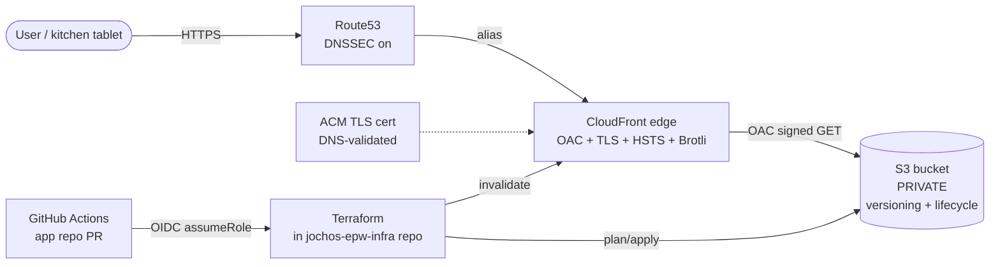

# Proposal: AWS Static Hosting (S3 + CloudFront + Route53, IaC in Terraform)

## Intent

Move the static frontend out of "un-deployed" — the four HTML files (`index.html`, `menu.html`, `checkout.html`, `admin.html`) plus the gitignored `supabase-config.js` exist on disk in `burger-site-draft/` but are not reachable on a public URL. The Supabase backend at `https://ouhwfkxqpxikqhwcqioc.supabase.co` is wired and working; without a TLS-hosted frontend it has no customer- or chef-facing surface. Today the only way to demo is opening files locally, which means Realtime from a kitchen tablet is not testable against real DNS, and no one outside the laptop can click the cart. This change hosts the existing static assets on AWS with explicit, version-controlled infra, while keeping Supabase exactly where it is.

## Scope (in)

- Static-site hosting on AWS: S3 (private bucket) + CloudFront (TLS, edge caching) + Route53 (DNS) + ACM (TLS cert)
- New sibling repo `jochos-epw-infra` containing Terraform modules, environment directories (`dev/` to start), and GitHub Actions workflows
- IaC in **Terraform** with **remote state in S3 + DynamoDB lock**
- Single deploy workflow in GitHub Actions: `terraform plan` on PR, `terraform apply` on merge to `main` (dev only; prod deferred)
- IAM deploy role with **least-privilege on a single bucket prefix**, assumed via OIDC (no long-lived AWS keys in GitHub secrets)
- S3 bucket: **private** (no website endpoint), **versioning** on, **lifecycle rule** for noncurrent versions
- CloudFront: **Origin Access Control (OAC)** — OAI is legacy and MUST NOT be used; ACM cert (DNS-validated); **TLS-only** with **HSTS** via response headers; **Brotli** compression; HTTP/2 + HTTP/3; HTML TTL 300s, asset TTL 1 year
- Route53: hosted zone, alias to CloudFront, **DNSSEC enabled**
- README in the infra repo covering: prerequisites, bootstrap a new env, rotate state, roll back a deploy

## Scope (out)

- Migrating Supabase to AWS — Supabase stays on `https://ouhwfkxqpxikqhwcqioc.supabase.co` exactly as-is
- Adding a build step, bundler, framework, or package manager to the app repo
- WAFv2 managed rule groups (deferred until traffic warrants the cost)
- Lambda@Edge / CloudFront Functions for URL rewrites (deferred; vanilla HTML needs no rewriting today)
- Multi-region failover / Route53 health checks
- AWS Secrets Manager (Supabase keys are already gated outside git in `supabase-config.js`)
- DNS for the Supabase project itself
- `prod` environment — same module will support it, but only `dev` is wired in this change; a second env is the natural follow-up slice
- Any changes to files inside `burger-site-draft/` — app code stays frozen during infra bootstrap

## What changes

**Deploy path (separate from runtime path):**

1. Edit HTML / `supabase-config.js` in `jochos-epw` app repo
2. Open PR → app repo CI runs `terraform plan` (read-only) against the dev env via OIDC assumeRole into `jochos-epw-infra`
3. Merge PR → app repo CI runs `terraform apply` + `aws s3 sync` + `aws cloudfront create-invalidation`
4. CloudFront serves the new files on next request; HTML TTL 300s keeps them fresh

Two repos, one direction: the app repo **consumes** infra (CI workflow lives in app repo), the infra repo **owns** infra (Terraform + state).

## Well-Architected Framework

| Pillar | Concrete decision |
|---|---|
| **Operational Excellence** | All infra in Terraform under version control. Remote state in S3 with DynamoDB lock — no local state, no concurrent apply footguns. Single deploy workflow in GitHub Actions. `terraform plan` runs on every PR against the infra repo and on every app-repo PR that touches deployable files. State is versioned so a bad apply can be diffed and reverted. |
| **Security** | S3 bucket has **no public website endpoint** and **no public bucket policy** — CloudFront is the only ingress. CloudFront uses **Origin Access Control (OAC)** to sign requests to S3; OAI is legacy and explicitly forbidden. ACM TLS cert pinned to the CloudFront distribution. Listener is HTTPS-only with **HSTS** via CloudFront response headers. Route53 **DNSSEC on**. GitHub Actions deploys via **OIDC assumeRole** — zero long-lived AWS keys in CI secrets; IAM policy is scoped to a single bucket prefix with `s3:PutObject`, `s3:DeleteObject`, `s3:GetObject`, `s3:ListBucket`, and `cloudfront:CreateInvalidation`. |
| **Reliability** | CloudFront absorbs global traffic at the edge; S3 provides 11 nines of durability. Bucket versioning means a bad `s3 sync` is recoverable by promoting a previous version. Lifecycle rule prunes noncurrent versions after 30 days so the bucket doesn't grow unbounded. Terraform state versioning catches a corrupted state file. No single-region dependency on an EC2 fleet means no capacity-planning failure mode. |
| **Performance Efficiency** | CloudFront edge caching with **Brotli** compression. HTTP/2 + HTTP/3 enabled on the distribution. HTML TTL **300s** so deploys surface in under five minutes without manual invalidation; static asset TTL **1 year** with content-hashed filenames (once we have any — today's filenames are not hashed, so first pass uses versioned object keys via `s3 sync`). No over-provisioned compute — serverless from end to end. |
| **Cost Optimization** | S3 storage is fractions of a cent per GB-month. CloudFront's free tier covers the weekend-MVP traffic forecast by several orders of magnitude. No EC2, no ALB, no NAT, no Lambda bill. Cost surprise protection: a single `--dryrun` flag on the deploy step lists `aws cloudfront create-invalidation` costs before firing; invalidations are batched per-deploy. |
| **Sustainability** | Smallest viable AWS footprint. No idle servers — S3 is pay-per-request at the storage layer, CloudFront scales to zero between requests. No always-on compute to power or cool. |

## Approach

| Pillar | Chosen | Alternative | Why chosen wins |
|---|---|---|---|
| **Frontend host** | S3 (private, OAC) + CloudFront | AWS Amplify Hosting | No build step → Amplify's CI-for-build value-add is null. Amplify URL-rewrite handling for vanilla HTML is finicky; S3+CloudFront is deterministic. WAF pillars align with explicit controls, not magic abstractions. |
| **IaC tool** | Terraform in `jochos-epw-infra` | AWS SAM / CDK / Amplify-managed | Terraform is the user's chosen toolchain across prior chains; declarative HCL matches the review budget; remote state in S3 is the well-trodden path. |
| **State backend** | S3 + DynamoDB lock | Local state / Terraform Cloud | Local state dies the moment two engineers exist. TFC is yet-another-account for an MVP. S3+DDB is free-tier-cheap and proven. |
| **Deploy trigger** | GitHub Actions OIDC assumeRole | Long-lived AWS access key in repo secret | OIDC eliminates a static credential that could be exfiltrated from a fork or a leaked GitHub token. |
| **TLS cert** | ACM cert validated via Route53 DNS | Email validation / imported cert | DNS validation is one-shot and re-runnable; email validation depends on inbox reachability. |
| **Branch strategy** | Chained slices, each <400 lines, each ending with a green deploy | One mega-PR | The 400-line review budget is binding; chained PRs are the established user workflow (existing chained-PR repo precedent). |

## Alternatives considered

| Option | Pros | Cons | Verdict |
|---|---|---|---|
| **AWS Amplify Hosting** | One-click Git integration, free TLS, built-in redirects/rewrites | Black-box deploy rules; URL rewrite handling for vanilla HTML is finicky; hides infra from the WAF pillars; another account to manage | **Rejected** — see approach table |
| **EC2 + ALB + nginx** | Maximum control, can run server-side later | Capacity-planning tax, always-on cost, security patching burden, contradicts "no server-side" stance | **Rejected** |
| **Single S3 website endpoint (no CloudFront)** | Cheapest, dead-simple single resource | TLS only via CloudFront in practice (S3 website endpoints don't support ACM certs in all regions for custom domains); no global edge; no Brotli-at-edge; bucket must be public | **Rejected** — no TLS guarantee |
| **Cloudflare Pages** | Free tier, great edge, easy Git deploy | Adds a fourth vendor relationship; user has chosen AWS for the cloud footprint; no opportunity to reuse IAM/OIDC pattern | **Deferred** — revisit if AWS cost surprises |
| **Netlify / Vercel** | Free tier, atomic deploys | Same vendor-sprawl concern as Cloudflare; doesn't fit the AWS-native WAF narrative | **Deferred** |

## Slice plan / PR boundaries

Each slice is a separate PR, ≤ ~400 lines of diff, each ends with a green deploy (or, for S1, a green plan-only run that touches zero AWS resources). The 400-line cap is binding.

| # | Slice | What ships | Smoke test |
|---|---|---|---|
| **S1** | Repo bootstrap | New `jochos-epw-infra` repo: README skeleton, Terraform skeleton with provider versions, `dev/` env dir, **remote-backend.tf pointing at a bootstrap S3 + DynamoDB** (created once via console or one-shot script), `terraform plan` GitHub Actions workflow (plan-only on PR, requires manual approval to apply). No AWS resources touched by `apply` yet. | Open PR → CI shows a `terraform plan` diff with zero changes. |
| **S2** | S3 bucket + OAC | `aws_s3_bucket` (private, versioning on, lifecycle noncurrent=30d, public-access block all-true), `aws_s3_bucket_policy` allowing only the CloudFront OAC principal (created in S3), `aws_cloudfront_origin_access_control`. **No distribution yet.** | `aws s3api get-object` from a deploy role with the right prefix returns the test file; from any other principal returns AccessDenied. |
| **S3** | CloudFront + ACM | `aws_cloudfront_distribution` with OAC origin, ACM cert (DNS-validated via Route53 — Route53 zone also created here if not at registrar), default-cache-behavior with Brotli, response headers policy adding HSTS + `X-Content-Type-Options: nosniff`, viewer-protocol-policy `redirect-to-https`. | `curl -I https://<dist-domain>` returns 200/403 + `Strict-Transport-Security` header; HTTP→HTTPS redirect works. |
| **S4** | Route53 + DNSSEC | `aws_route53_zone`, `aws_route53_record` alias A/AAAA to the CloudFront distribution, DNSSEC enabled (KMS-backed KSK, sign with the parent zone at the registrar — manually documented in the README). | `dig +dnssec <domain>` shows `ad` flag; `dig <domain>` returns the CloudFront alias target. |
| **S5** | Deploy automation (the wiring) | App-repo GitHub Actions workflow: OIDC assumeRole into the infra repo's deploy role, runs `terraform apply -auto-approve` (gated to `main`), then `aws s3 sync` for the four HTML files + `supabase-config.js`, then `aws cloudfront create-invalidation --paths "/*"` behind a `DISABLE_INVALIDATION` PR flag. **NOT** chained-to-main: a deploy happens on every merge, not on every chained-slice PR. | Merge a one-character edit to `index.html` → CI applies → CloudFront serves the new bytes within 60s. |
| **S6 (optional, follow-up)** | Prod env | New `prod/` env dir, separate state file (same module), separate deploy role, separate CloudFront distribution. Same S3 bucket pattern. | Smoke test identical to S3 against prod domain. |

## Non-goals

No Supabase migration. No backend code (still Supabase). No build tooling in the app repo. No framework or SSR. No WAFv2 managed rules yet. No Lambda@Edge or CloudFront Functions until we actually need a URL rewrite. No multi-region. No prod environment in this change. No edits to any file in `burger-site-draft/`.

## Success criteria

- [ ] `terraform plan` on the infra repo shows the full intended AWS graph and applies cleanly
- [ ] `https://<dev-domain>` returns 200 over HTTPS with HSTS header present
- [ ] `http://<dev-domain>` redirects to HTTPS (301/302) — no plaintext ingress
- [ ] `curl https://<dev-domain>/menu.html` returns the same bytes as the on-disk `burger-site-draft/menu.html`
- [ ] `https://<dev-domain>/admin.html` loads, JS bootstraps Supabase from `supabase-config.js`, Realtime connects
- [ ] S3 bucket has `BlockPublicAccess` set to `on` for all four flags; `aws s3api get-bucket-policy-status` returns `IsPublic: false`
- [ ] Route53 zone has DNSSEC enabled (`dig +dnssec` returns the `ad` flag)
- [ ] No long-lived AWS access key exists in any GitHub secret; CI uses OIDC assumeRole
- [ ] Deploy from a one-char edit in `index.html` lands in CloudFront in under 5 minutes
- [ ] `terraform apply` is idempotent — running it twice produces zero changes on the second run
- [ ] README documents: prerequisites, bootstrap-a-new-env, rotate-state, roll-back-a-deploy
- [ ] All six WAF pillars satisfied as documented above

## Risks

| # | Risk | Severity | Mitigation |
|---|---|---|---|
| 1 | **OAC misconfiguration exposing the bucket publicly** | High | S3 bucket policy denies `*` and allows only the CloudFront service principal via the OAC. `BlockPublicAccess` set to `on` for all four flags. Verify phase: `aws s3api get-bucket-policy-status` MUST return `IsPublic: false`; unauthenticated `curl https://<bucket>.s3.amazonaws.com/<file>` MUST return AccessDenied. |
| 2 | **Terraform state loss** | High | State in S3 with versioning on; lock via DynamoDB. README documents the rotate-state procedure (pull latest version from S3, restore). State bucket itself has its own BlockPublicAccess + lifecycle. |
| 3 | **IAM deploy role over-privileged** | Medium | Scope policy to a single bucket prefix (e.g., `arn:aws:s3:::jochos-epw-static-dev/*`) and to `cloudfront:CreateInvalidation` only on the dev distribution ARN. Use `aws iam simulate-principal-policy` in verify phase to prove no extra permissions. |
| 4 | **CloudFront invalidation cost surprise** | Medium | Invalidation is opt-out via repo variable: invalidations are always created on production deploys, but a `DISABLE_INVALIDATION` PR flag suppresses them for content-only pushes (HTML TTL 300s makes this safe). README documents the $0 cost of the first 1,000 invalidations/month per the CloudFront free tier. |
| 5 | **CNAME collision with Supabase** | Medium | The chosen dev domain is dedicated to the frontend only — never overlaps with `*.supabase.co` or `supabase.io`. Verify phase lists Route53 records to confirm no apex or subdomain pointed at Supabase. Document the boundary in the README. |

## Open questions

1. **Domain name?** The orchestrator-side decision needed before S4 lands. Suggest `dev.jochosepw.com` (or similar) under a new Route53 zone, with the apex reserved for the eventual `prod` slice. Confirm before S4.
2. **Are you OK starting dev-only and adding prod as a follow-up slice (S6)?** Current proposal yes; deferring prod keeps this change under the 400-line budget.
3. **GitHub org for the new `jochos-epw-infra` repo?** Same org as `jochos-epw`? I will scaffold it locally as a sibling; final placement is yours at apply time.
4. **Renaming the project** — `openspec/config.yaml` notes "jochos-epw (working name; subject to rename during proposal phase)". If a rename is happening, the bucket name and domain choice should reflect that — surface the final name now to avoid a rename churn mid-deploy.

## Capabilities

### New Capabilities

- `static-hosting`: AWS-hosted static-site topology — S3 (private, OAC-only, versioning, lifecycle) fronted by CloudFront (TLS, HSTS, Brotli, HTTP/2+3) fronted by Route53 (DNSSEC, alias). Deploy automation via GitHub Actions OIDC.
- `iac-repo`: Separate `jochos-epw-infra` repo holding Terraform modules, per-env state backends, remote-state bootstrap, IAM deploy roles, and CI workflows.

### Modified Capabilities

- None — no existing OpenSpec capability is touched. App code in `burger-site-draft/` is frozen during this change; only the hosting surface is added.

## Invariants (binding across all downstream phases)

1. `burger-site-draft/` is **read-only** during this change. No file inside it is modified by apply.
2. The S3 bucket has `BlockPublicAccess` set to `on` for all four flags in **EVERY** slice from S2 onwards. No slice may relax this.
3. **OAI is forbidden.** CloudFront MUST use **Origin Access Control (OAC)**. OAC is the modern, SigV4-based control; OAI is legacy and AWS-deprecated.
4. **No long-lived AWS credentials** in any GitHub secret. Deploys use OIDC assumeRole exclusively.
5. **TLS-only.** CloudFront viewer protocol policy is `redirect-to-https`. HSTS header is set on every response.
6. **DNSSEC on** for the Route53 zone from S4 onwards.
7. **No build step** is added to the app repo. Deployment is `aws s3 sync` of four HTML files + `supabase-config.js`. No bundler, no transpiler, no framework.
8. **Supabase stays at `https://ouhwfkxqpxikqhwcqioc.supabase.co`.** No DNS change, no infra change, no schema change to Supabase.
9. Each slice is **≤ ~400 lines of diff** and ends with a green deploy (or, for S1, a green plan-only CI run with zero resource changes).
10. The infra repo MUST have a README covering: prerequisites, bootstrap-a-new-env, rotate-state, roll-back-a-deploy.

## Rollback Plan

**Per-slice rollback** (each slice is independently reversible):

- **S1, S2**: Delete the GitHub repo (if empty) or the Terraform-managed resource via `terraform destroy -target=...`. No user-facing surface yet.
- **S3, S4**: Point the domain's DNS back to the previous A record (or, if first deploy, remove the alias). CloudFront distribution deletion is reversible by re-applying from the same state version.
- **S5 (deploy automation)**: Revert the GitHub Actions workflow file in the app repo. Existing CloudFront distribution still serves the last-synced S3 contents — no traffic loss during the revert.
- **Promote previous S3 version**: For a bad HTML deploy, `aws s3 cp s3://<bucket>/<file>?versionId=<prior> s3://<bucket>/<file>` restores the prior bytes; trigger a CloudFront invalidation. Bucket versioning is what makes this safe.

**Full rollback**: `terraform destroy` from the same state file removes S3 bucket (after manual `aws s3 rm` of objects), CloudFront distribution, ACM cert, Route53 zone records, IAM role. DNS at the registrar is the only out-of-band change; the README documents it.

If the entire approach is wrong: tear down all AWS resources via `terraform destroy`, drop the `jochos-epw-infra` repo, delete the GitHub OIDC trust. App repo is untouched, Supabase is untouched — the only lost work is the infra code itself, which is version-controlled in `jochos-epw-infra`.
